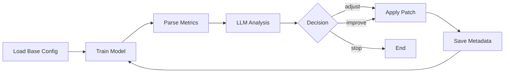

# ValTune-Agent

**LLM-Powered Hyperparameter Tuning System for Deep Learning Models**

An intelligent automation framework that uses Large Language Models (DeepSeek) to analyze training metrics and iteratively optimize hyperparameters, eliminating manual trial-and-error.

---

## 🚀 Features

- **🤖 LLM-Driven Optimization**: DeepSeek API analyzes metrics and suggests hyperparameter adjustments
- **🔄 Iterative Tuning Loop**: Automatically trains, evaluates, and refines configurations
- **📊 Comprehensive Tracking**: Records all rounds with configs, metrics, and decisions
- **🎯 Smart Early Stopping**: LLM determines when to stop based on convergence patterns
- **🔧 Dual Workflow Modes**: Simple loop or LangGraph state machine
- **📈 Rich Metrics Support**: mAP50, mAP50-95, precision, recall, validation loss

---

## 📁 Project Structure

```
ValTune-Agent/
├── agents/
│   ├── graph.py           # LangGraph workflow orchestration
│   ├── schemas.py         # Pydantic data models
│   └── tuner_prompt.py    # LLM system prompts
├── tools/
│   ├── config_io.py       # YAML config management
│   ├── metrics.py         # Metrics parser (JSON/CSV)
│   └── runner.py          # Training subprocess launcher
├── cli.py                 # Main entry point
├── mock_train.py          # Mock training for testing
└── configs/
    └── base.yaml          # Initial hyperparameters
```

---

## 🛠️ Installation

```bash
# Clone repository
git clone https://github.com/yourusername/ValTune-Agent.git
cd ValTune-Agent

# Install dependencies
pip install -r requirements.txt

# Set API key
export DEEPSEEK_API_KEY="your-api-key"  # Linux/Mac
$env:DEEPSEEK_API_KEY="your-api-key"   # Windows PowerShell
```

**Requirements:**
- Python 3.10+
- langchain-deepseek
- langgraph
- pydantic
- pyyaml

---

## ⚡ Quick Start

### 1. Test with Mock Training (No GPU Required)

```bash
python cli.py \
  --base-config configs/base.yaml \
  --train-cmd "python mock_train.py --cfg {config} --run_dir {run_dir}" \
  --simple-loop \
  --max-rounds 3
```

**What happens:**
- **Round 0**: Trains with initial config (lr=0.001, batch=16)
- **Round 1**: LLM analyzes metrics → adjusts hyperparameters → retrains
- **Round 2**: LLM continues optimization based on trends
- **Round 3**: Stops when convergence detected or max rounds reached

### 2. Real Training (e.g., YOLO)

```bash
python cli.py \
  --base-config configs/base.yaml \
  --train-cmd "python train.py --cfg {config} --data coco128.yaml --run_dir {run_dir}" \
  --max-rounds 10
```

---

## 📊 Example Output

```
============================================================
Round 0
============================================================
Launching training with config:
  lr: 0.001
  batch: 16
  epochs: 100

Validation Metrics:
  mAP50:    0.7151
  mAP50-95: 0.4623
  Precision: 0.6302
  Recall:    0.6184

Calling LLM for decision...

Decision:
  Action: adjust
  Reason: mAP50 shows good initial performance but has room for 
          improvement. Learning rate appears adequate. Try reducing 
          learning rate for finer convergence.
  Patch: {'lr': 0.0005, 'weight_decay': 0.001}

Config updated for next round

============================================================
Round 1
============================================================
[Training continues with optimized hyperparameters...]
```

---

## 🔧 Configuration

### Base Config (`configs/base.yaml`)

```yaml
model: yolov8m.pt
data: coco128.yaml
epochs: 100
batch: 16
imgsz: 640
lr: 0.001
weight_decay: 0.0005
momentum: 0.937
patience: 20
device: 0
```

### CLI Arguments

| Argument | Default | Description |
|----------|---------|-------------|
| `--base-config` | `configs/base.yaml` | Initial hyperparameters |
| `--train-cmd` | *Required* | Training command template |
| `--max-rounds` | `20` | Maximum tuning iterations |
| `--timeout` | `None` | Training timeout (seconds) |
| `--simple-loop` | `False` | Use simple loop (vs LangGraph) |
| `--api-key` | `$DEEPSEEK_API_KEY` | DeepSeek API key override |

---

## 📈 Training Command Template

Use placeholders `{config}` and `{run_dir}` in your training command:

```bash
# YOLO example
--train-cmd "python train.py --cfg {config} --run_dir {run_dir}"

# PyTorch Lightning example
--train-cmd "python main.py --config {config} --output {run_dir}"

# Custom script
--train-cmd "python my_train.py -c {config} -o {run_dir}"
```

**Requirements for training script:**
- Accept config path and output directory
- Save metrics to `{run_dir}/results.json` or `results.csv`
- Use JSON format: `{"metrics/mAP50(B)": 0.75, "metrics/mAP50-95(B)": 0.48, ...}`

---

## 📂 Output Structure

```
runs/
├── round_0/
│   ├── config.yaml          # Configuration used
│   ├── results.json         # Training metrics (100 epochs)
│   ├── metadata.json        # Round summary + LLM decision
│   └── train_stdout.log     # Training logs
├── round_1/
│   ├── config.yaml          # Updated with lr=0.0005
│   ├── results.json
│   └── ...
└── round_2/
    └── ...
```

**`metadata.json` Example:**

```json
{
  "round": 1,
  "config": {
    "lr": 0.0005,
    "batch": 16,
    "epochs": 100
  },
  "metrics": {
    "map_50": 0.7106,
    "map_50_95": 0.4715,
    "precision": 0.6279
  },
  "decision": {
    "action": "adjust",
    "reason": "Model stuck in local minimum. Increase learning rate.",
    "patch": {
      "lr": 0.001
    }
  }
}
```

---

## 🧠 How It Works



**Workflow Steps:**

1. **Training**: Execute training command with current config
2. **Metrics Parsing**: Extract mAP50, mAP50-95, loss from output
3. **LLM Analysis**: DeepSeek analyzes trends and suggests adjustments
4. **Config Update**: Apply hyperparameter patches (lr, batch_size, weight_decay)
5. **Iteration**: Repeat until convergence or max rounds

---

## 🎯 Use Cases

- **Object Detection**: YOLO, Faster R-CNN tuning
- **Image Classification**: ResNet, EfficientNet optimization
- **Semantic Segmentation**: UNet, DeepLab hyperparameter search
- **Any PyTorch Model**: Custom training scripts with metric output

---

## 🔬 Advanced Features

### LangGraph State Machine (Default)

```bash
python cli.py --base-config configs/base.yaml --train-cmd "..."
```

Uses a 6-node state machine for complex workflows:
- `load_config` → `train` → `evaluate` → `decide` → `apply_patch` → `check_stopping`

### Simple Loop Mode

```bash
python cli.py --base-config configs/base.yaml --train-cmd "..." --simple-loop
```

Sequential execution for easier debugging.

---

## 🤝 Contributing

Contributions welcome! Please:

1. Fork the repository
2. Create a feature branch (`git checkout -b feature/amazing`)
3. Commit changes (`git commit -m 'Add amazing feature'`)
4. Push to branch (`git push origin feature/amazing`)
5. Open a Pull Request

---

## 📄 License

MIT License - see [LICENSE](LICENSE) for details

---

## 🙏 Acknowledgments

- **LangChain**: LLM orchestration framework
- **LangGraph**: State machine workflow engine
- **DeepSeek**: Powerful LLM API for analysis

---

## 📧 Contact

- **Issues**: [GitHub Issues](https://github.com/yourusername/ValTune-Agent/issues)
- **Email**: your.email@example.com

---

**⭐ Star this repo if ValTune-Agent helps your research!**
